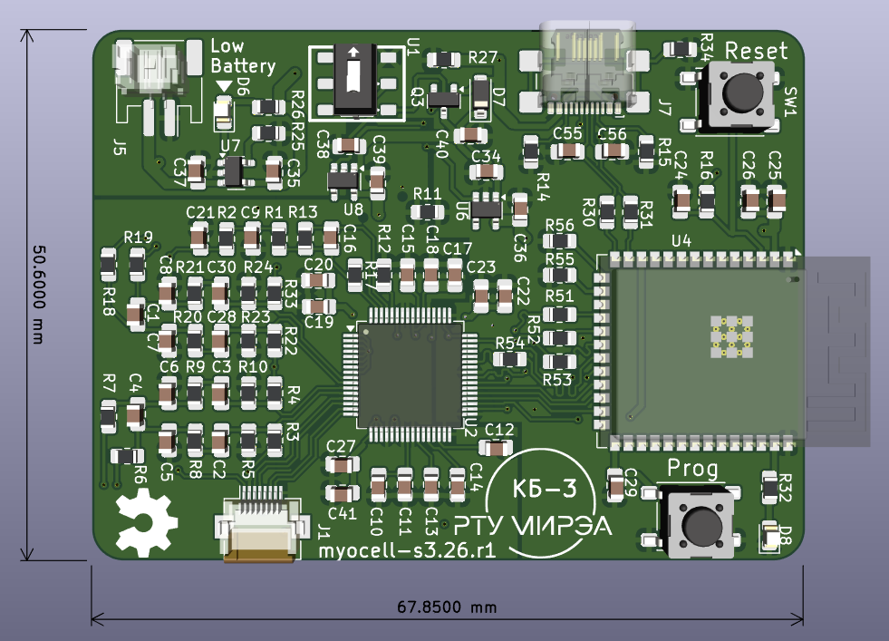
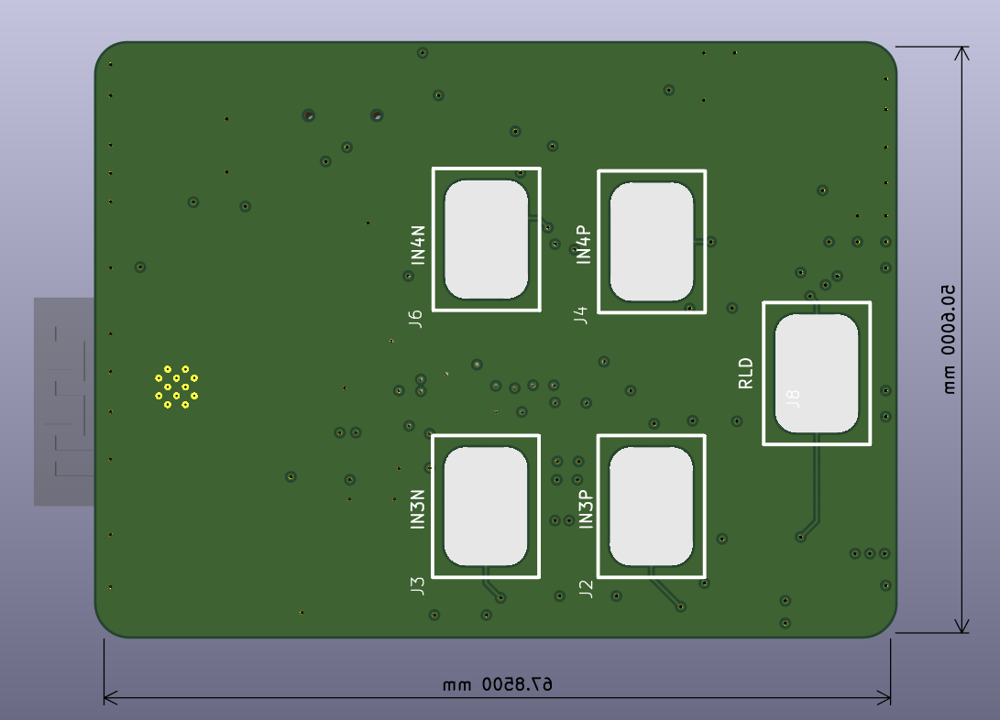
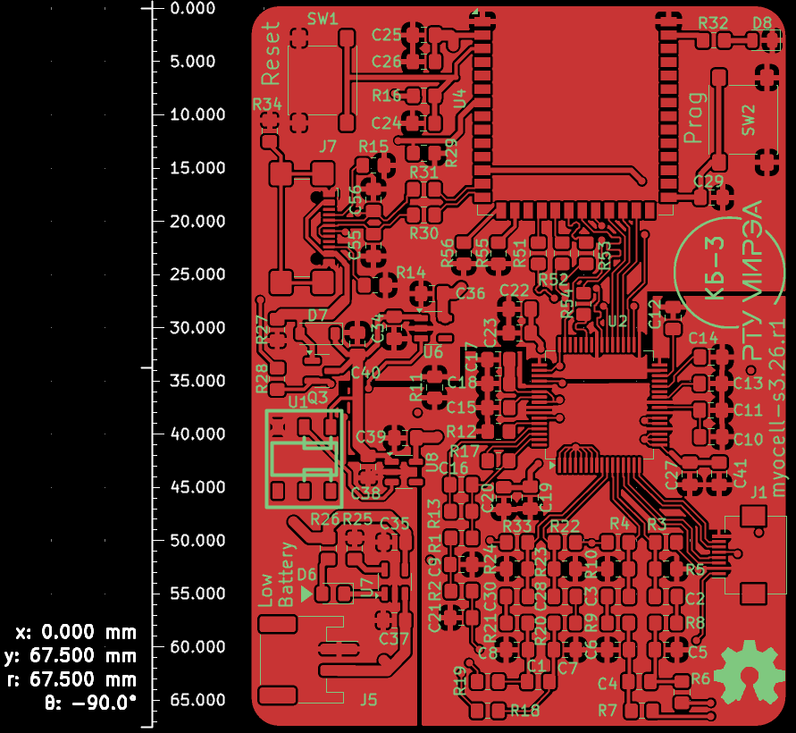
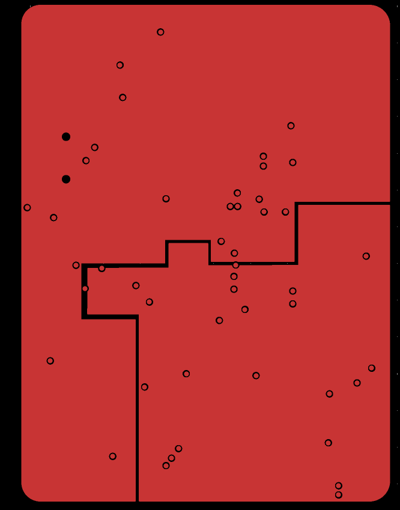
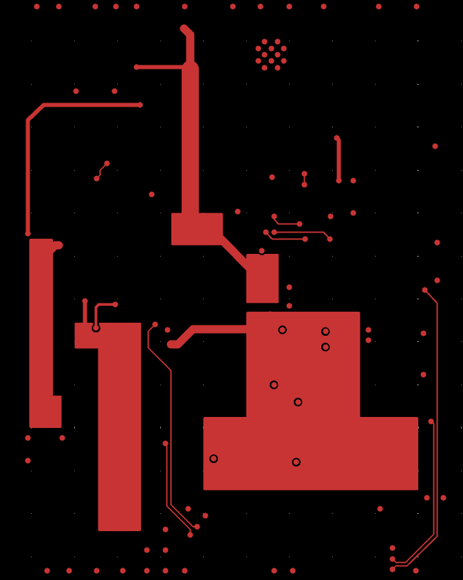
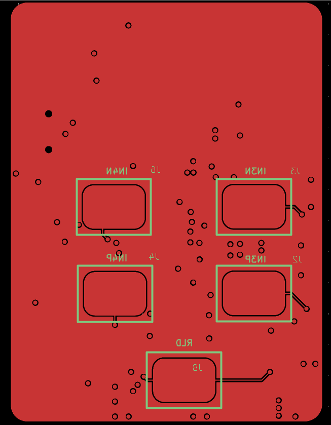

# multiboard myocell-s3 design

ADC + CPU board for multiboard MYOCELL design. Includes [ADS1298(4)](https://static.chipdip.ru/lib/395/DOC009395274.pdf) and [ESP32-S3-WROOM-2](https://www.espressif.com/sites/default/files/documentation/esp32-s3-wroom-2_datasheet_en.pdf). Design based on ideas from [HeartyPatch](https://hackaday.io/project/21046-heartypatch-a-single-lead-ecg-hr-patch-with-esp32), [Adafruit Feather ESP32-S3](https://learn.adafruit.com/assets/110822), [electronics-homeassistant-lightscontroll
](https://github.com/crgarcia12/electronics-homeassistant-lightscontroll) etc.

## Revision history
 Sent to rezonit 2026.03.16

* BOM: [Interactive BOM ()](https://htmlpreview.github.io/?https://github.com/RF-Lab/emg-lab/blob/main/myocell_s3/bom/ibom.html)

### Top View

### Bottom View

## Gerbers

### Top+Silkscreen

### Inner 1 (under top)

### Inner 2

### Bottom+Silkscreen

## Dependencies

* [Espressif KiCad Library](https://github.com/espressif/kicad-libraries)
